# Hi there 👋

**griarsvah/griarsvah** is a ✨ _special_ ✨ repository because its `README.md` (this file) appears on your GitHub profile.

Here are some ideas to get you started:
## Hi there My name is Vahe Grigoryan
===============================================================

## FrontEnder | QA Engineer
-----------

I'm a QA at Yandex.Eats working on the Yandex team, focused on making a better service through standardization, creating and sharing best practices, and doing research.

* 🌍 I'm based in Armenia
- 👋 Hi, I’m Vahe
- 👀 I’m interested in IT
- 🔭 I’m currently working on Yandex.Eats as QA
- 🌱 I'm learning Angular | QA Engineer
- 👯 I’m looking to collaborate on everyone
- 🤔 I’m looking for help with working as QA enginer
- 💬 Ask me about everything 
- 📫 How to reach me: [griarsvah@gmail.com](mailto:griarsvah@gmail.com),  [t.me](https://t.me/GriArsVah)
- 😄 Pronouns: he/him

### Skills

### Socials

<a href="https://www.github.com/GriArsVah/" target="_blank" rel="noreferrer"><picture><source media="(prefers-color-scheme: dark)" srcset="https://raw.githubusercontent.com/danielcranney/readme-generator/main/public/icons/socials/github-dark.svg"><source media="(prefers-color-scheme: light)" srcset="https://raw.githubusercontent.com/danielcranney/readme-generator/main/public/icons/socials/github.svg"></picture></a>

 https://github.blog/

#### Nodes

```mermaid
flowchart LR
    github-->gitlab
    gitlab-->github-blog
    github-blog-->github-docs
    github-docs-->github-pages
    github-pages-->git-book
    git-book-->git-scm
    git-scm-->github-cli
    github-cli-->github
    click github href "https://www.github.com/" "Open this in a new tab" _blank
    click gitlab href "https://gitlab.com/" "Open this in a new tab" _blank
    click git-scm href "https://git-scm.com/" "Open this in a new tab" _blank
    click github-blog href "https://github.blog/" "Open this in a new tab" _blank
    click github-docs href "https://docs.github.com/" "Open this in a new tab" _blank
    click github-pages href "https://pages.github.com/" "Open this in a new tab" _blank
    click git-book href "https://www.gitbook.com/" "Open this in a new tab" _blank
    click github-cli href "https://cli.github.com/" "Open this in a new tab" _blank
```

